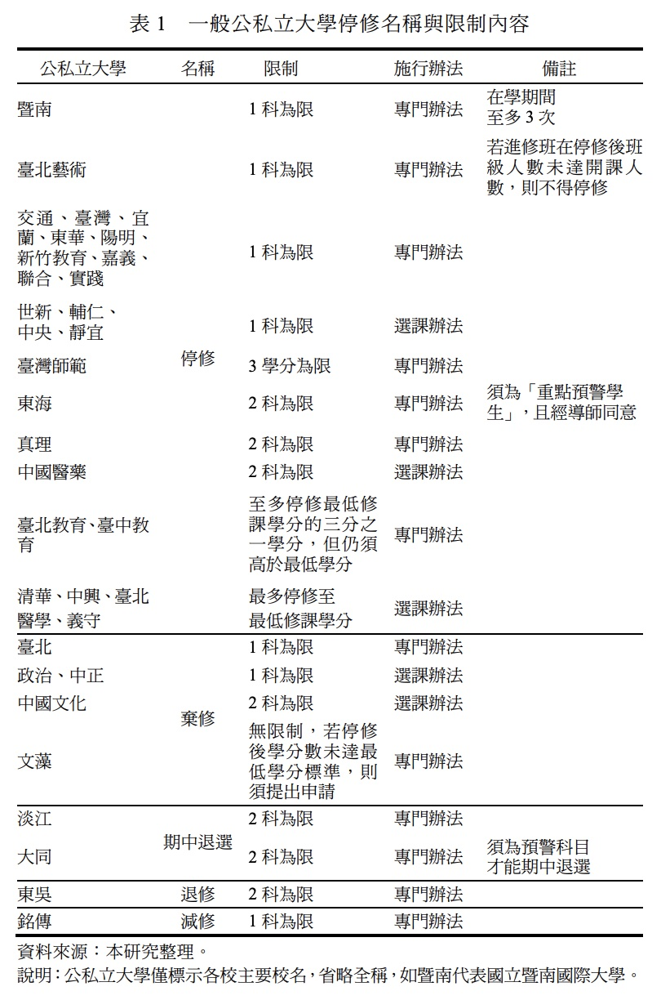

# 摘要 {#abstract}

本文以北部某私立大學校務資料分析什麼課程的停修比例較
高，何類學生較可能停修。課程面分析顯示科目不及格比率越高或
平均分數越低，停修比例越高。雖然兩者都反映困難科目的停修較
高，但學生停修對分數反應更為敏感，顯示兩者捕捉到的反應有所
不同。學生成績在及格邊緣才會在意及格與否，但大部分學生都在
意分數高低，是以學生對分數較為敏感。0 至 4 學分的課程中，2 學
分（含）以上的課程停修較高，這與停修的成本及效益有關，停修
效益是立即性的，如釋出時間、成績提升與逃避退學；成本為拉長
就讀時間形成延畢，屬未來發生。因此停修學分數太低不符合當下
效益。必修課程因停修後仍須重修，以及下學期課程因經過上學期
的適應與篩選，此兩課程因素也會造成停修比例較低。以學生面來
分析顯示成績佳與無二一記錄的學生較不會停修；女性及推薦生與
繁星生停修比例低，停修是修正選課錯誤，這可能反映出女性及推
薦生與繁星生做事較有規劃；四年級與一年級學生停修比例較低，
可能與四年級學生有較豐富的選課經驗，對自我能力評估與時間分配較能掌握，一年級學生則可能較不清楚停修規定或不清楚如何評
估自我能力與時間分配，以致未申請停修。對成績落後學生，停修
能減低他們被退學的機率，但也提高延畢的可能。

# 緒論

在臺灣，大學所存在的期中退選制度 (course withdrawals) 由來
已久，透過彈性的選課制度讓學生在學期初選課完成後，在學期間
可以退掉原本已選修的科目，這樣的期中退選制度在國外大學亦已
實施許久。退選設計在校務治理上有其重要性，大學自主治理的一
項重要課責 (accountability)項目即在於學生的畢業穩定性，而影響穩定性的一項重要變數就在於課程的退選制度，主要是因退選制度會延長學生的畢業時間 (Burd, 2003; Hall et al., 2003)。而退選課程所造成的畢業率下降，也將間接影響行政同仁對於校務資源的運用成效。若能有效掌握影響學生期中退選的可能因素，將有助於回應學生實際需求及校務經營 (Dunwoody and Frank, 1995; Hall et al., 2003;Burk et al., 2013)。

臺灣的交通大學及清華 ...


```{r,echo=F, fig.cap="表一", fig.align = 'center'}

```

# 資料來源與初步分析

## 資料來源及學生面與課程面基本資料

本文資料取自北部某私立大學校務資料，該所大學創立於中國大陸，民國四十年代在臺復校，為臺灣第一所私立大學。資料蒐集期間，該校有人文社會學院、外國語言學院、理學院、法學院及商學院等 5 個學院，以 100 學年度入學新生來說，平均學測成績為 54.91級分，當年度的學測前標為 58 級分，均標為 48 級分，該校新生學測介於前標與均標間，其中以法學院最高，學測平均接近 60級分，優於前標；商學院次之，平均為 57.06 級分。該校每年入學一年級新生約 2,700 位。

\begin{equation}
  E=mc^2
  (\#eq:emc)
\end{equation}


@R-base


# References

